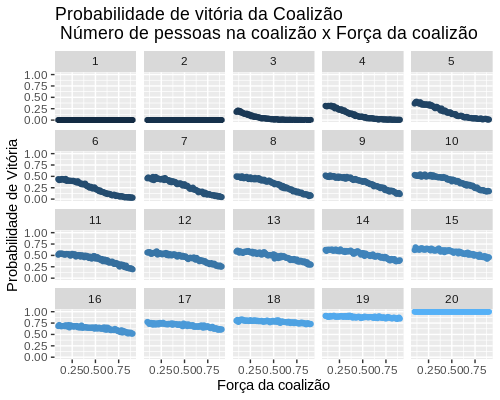
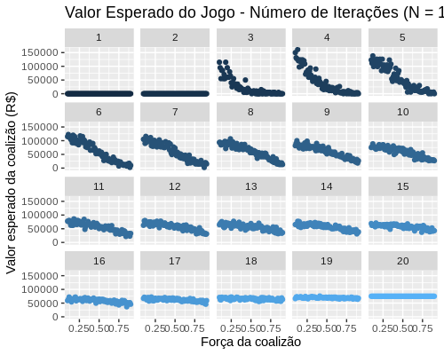

A última edição do BBB acabou faz tempo. Porém, durante o fervor do programa nas redes, fiquei me questionando se havia alguma estratégia dominante para algum dos participantes. 
Evidentemente, é um jogo subjetivo que se baseia no voto popular (que ultrapassa a população brasileira em 2 vezes), logo não há nenhum tipo de racionalidade geral que se aplique aos participantes específicos. O amado hoje é odiado amanhã, e isso acontece com todas as combinações de sentimento durante a duração do programa.

A exclusão dos participantes ocorre de maneira aleatória. Então, nessa abstração da realidade, o ambiente físico desse jogo é:

1. Existem 20 jogagores
2. As rodadas são formadas por todos os participantes
3. A cada rodada, sai apenas 1 jogador
4. A última rodada é formada por 3 jogadores
5. A probabilidade de sair é idêntica para todos os jogadores

Nessas configurações, a probabilidade de qualquer um dos jogadores ganhar o BBB é igual. E por isso é sem graça.

Uma possível estratégia que fugiria dessa situação homogênea seria uma coalizão. Na coalizão, um grupo de pessoas pode fazer com que a probabilidade de sair das pessoas fora da coalizão seja maior do que a probabilidade dos membros do grupo. O equivalente no mundo real seria um conjunto de pessoas que se comportam de certa maneira que faz com que a chance de alguém do grupo sair do jogo seja menor do que alguém fora do grupo. Então, podemos remodelar o ambiente físico do jogo:

1. Existem 20 jogagores
2. Existem S pessoas dentro da coalizão 
3. As rodadas são formadas por todos os participantes
4. A cada rodada, sai apenas 1 jogador
5. A última rodada é formada por 3 jogadores
6. A probabilidade de alguém da coalizão sair é menor que a probabilidade de alguém fora da coalizão sair
7. O prêmio é dividido igualmente entre os membros da coalizão, caso haja vitória de algum membro

A pergunta que resta é: 
**Quantos pessoas dentro da coalizão são necessárias para que algum dos membros da coalizão ganhe *com certeza* o jogo?**

Vamos ao modelo:

Seja $J = \{1,2,...,20\}$ a índice de cada jogador.

Seja $S \subseteq J$ os índices dos jogadores que fazem parte da coalizão.

**Hipótese 1 - Probabilidade igual para jogadores da coalizão**

$$ \forall i,j \in S: p_i = p_j $$

**Hipótese 2 - Probabilidade igual para jogadores fora da coalizão**

$$ \forall i,j \in S^c: p_i = p_j $$

**Hipótese 3 - Probabilidades dentro e fora da coalizão**

Existe um $\alpha \in (0,1)$ que mede o quão forte a coalizão é. Para valores muito próximos de 1, a coalizão é fraca. Então: 

$$p^s = \alpha p^{s^c}$$

Seja **M** o número de jogadores dentro da coalizão em cada rodada

Seja **N** o número total de jogadores em cada rodada

Então:

$$\sum_{i \in S} p_i^s + \sum_{i \in S^c} p_i^{s^c} = 1$$

$$M p^s + (N-M)p^{s^c} = 1$$

$$\alpha M p^{s^c} + (N-M)p^{s^c} = 1$$

$$Np^{s^c} + (1-\alpha)Mp^{s^c} = 1$$

$$p^{s^c}(N - (1-\alpha)M) = 1$$

$$p^{s^c} = \frac{1}{(N - (1-\alpha)M)}$$

Note que essa última equação é a probabilidade de um jogador fora da coalizão sair do jogo. Essa probabilidade é função do número de jogadores em cada rodada (*N*), do número de jogadores na coalizão em cada rodada (*M*) e do quão forte é a coalizão ($\alpha$).

Transformando isso em código, obtemos o seguinte resultado:

Cada quadrado desse gráfico representa o número de pessoas na coalizão. Evidentemente, com 20 pessoas na coalizão, a chance de ganhar é 100%. Já com uma pessoa na coalizão, a chance de alguém da coalizão ganhar é 0%. Um ponto interessante é que com 19 pessoas na coalizão, a probabilidade de vitória nãe é 100%, mas é algo muito próximo disso. 

Fica claro que todos os gráficos têm tendência decrescente, de modo que a probabilidade de alguém da coalizão ganhar diminui o quão mais fraca é o poder da coalizão, mas essa queda é heterogênea. Com muitas pessoas, essa redução é menos expressiva. 

Então a resposta a nossa pergunta é essa: Apenas com 20 pessoas na coalizão temos certeza de vitória. Mas a estratégia parece ser viável com apenas 10 pessoas na coalizão (primeiro grupo com mais de 50% de probabilidade de vitória), mas esse caso é contingente à força da coalizão.

Agora note que se o prêmio é dividido entre os membros da coalizão, uma coalizão grande significa que uma menor parte para cada membro, o que pode ser não estratégia dominante se o objetivo do indivíduo for maximizar o retorno, não a chance de ganhar. Assim, usando o valor do prêmio da última edição do BBB (R$ 1.5 mi) temos o gráfico do valor esperado por membro da coalizão, que nada mais é que:

$$ E(S)_c = \frac{P(Ganhar)* 1500000  + P(Perder) * 0}{n} $$

O valor esperado mais alto vem de uma coalizão muito forte ($\alpha = 0.1$) com 4 pessoas, o que é um resultado inesperado. Então, da próxima vez que você assistir ao BBB e ver 4 pessoas se juntando com maior proximidade, saiba que elas leram (muito provavelmente não) esse post.

